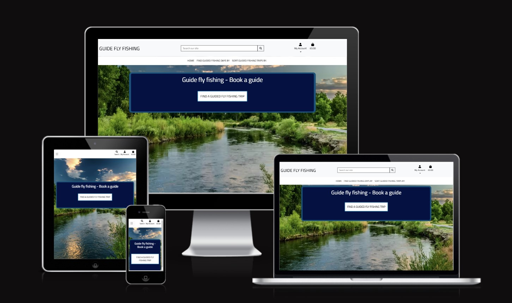
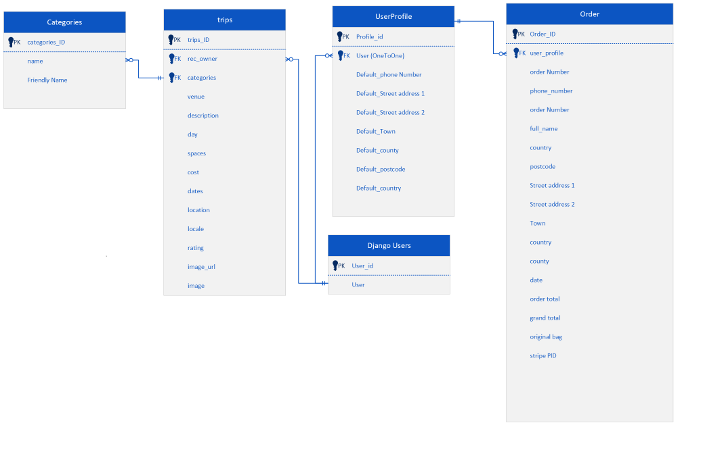
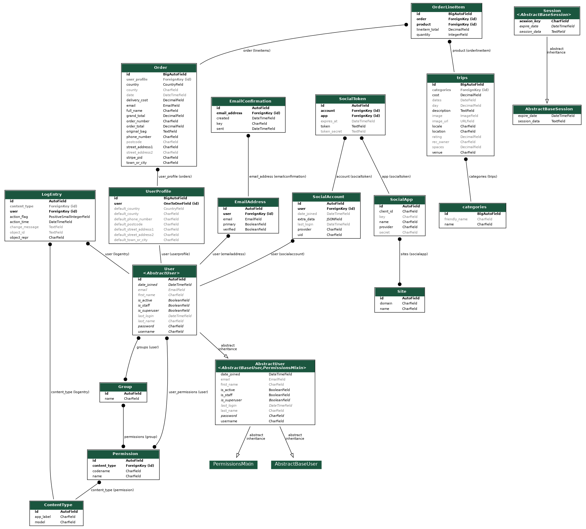

# [PROJECT GUIDEFLYFISHING](https://p4guideflyfishing-879a54f37efc.herokuapp.com)

[](https://github.com/Coelecanth/Project-guideFlyFishing/commits/main)
[](https://github.com/Coelecanth/Project-guideFlyFishing/commits/main)
[](https://github.com/Coelecanth/Project-guideFlyFishing)

So for my commercial Website project (called "Guide Fly Fishing"), I took the idea that I had used in my previous projects and developed this into further extension of the idea and business of a fly fishing business which would complement my previous. In the the previous iterations I had a site advertising a fly fishing destination in Alaska and a flyfishing blog. I took this idea and thought about how this would be further developed, I came up with the idea of having a commercial site where you could visit and purchase guided fly fishing days, as an end user. The site is primarily targetted at UK based customers, to allow them to purchase guided fly fishing (it does however cater for people and business outisde the Uk guided fly fishing as well). 

### Who is this aimed at?
The site is primarily aimed at fly fisher looking for expert knowledge at a venue or trip they would like make and then fish at. There are sites out there currently offering something similar, but they are not able to aggreagte a wholw host of trips from different vendors/individuals into a singel place with conveiniece to purchase difrectly.
The thypical vendor who would use this is intended to be small business to single inviduals offering there services to fly fishing audience.

### How would it work 
The site works on the principal that guides or even lodges could potentially offer there service and then customer can purchase directly guided trips from the site. 
So the guide or venue, can crete a "trip" that advertises a particualr place/venue, spacess avaiable,  with dates ,and number of days duration and cost.
The purchase mechansim works very much like the big commercial websites (amazon, ebay as an example) where the money is paid to the host organaisation and then supplier of the service is paid. The payment of service supplier is beyond the scope of this.      



GitHub now supports CALLOUTS in Markdown files.
There are some callouts already embedded in this application for you.
However, if you feel that you want to add more, there are certain ones you can use.

NOTE: the preview for callouts isn't yet supported in Gitpod/Codeanywhere/VSCode/etc.
You'll have to commit/push the changes to GitHub to see it in action.

> [!NOTE]  
> BLUE: Highlights information that users should take into account, even when skimming.

> [!TIP]  
> GREEN: Optional information to help a user be more successful.

> [!IMPORTANT]  
> PURPLE: Crucial information necessary for users to succeed.

> [!WARNING]  
> YELLOW: Critical content demanding immediate user attention due to potential risks.

> [!CAUTION]  
> RED: Negative potential consequences of an action.

## UX
I started creating the site to try and make a site that was pleasing to the user, but also easy to use without any need for instruction, and the site to be as informative as possible as users interacted with it, such as add items to the bag, etc.
The overall design of the site I wanted to depart from previous ideas of reflecting the natural world and so went for a more water-based colour theme, but still keeping the site as user friendly as possible by standardising on elements such as making the buttons have good contrast where ever they are used. 

### Navigation bar
I based the design of my site on some of the elements of the teaching material in the course, I particularly liked the navigation bar that was used, for several reasons 
 - First it has good responsiveness across screens 
 - Provides all the information for user navigation and interaction in one place  
 - Used Bootstrap which I had found to be a highly configurable and stable solution to the give CSS and styling I wanted. I have used materialize in previous projects and found this to be troublesome in some areas.

### Creating user Focus
I chose to represent content using a container (banner) which was placed over the scenic river image, this gave me many benefits
 - It allowed me to create the strong sense of theme i wanted for the site, with colours and image visibility.
 - The container could easily be adjusted to accommodate placement based on changing size of the navbar and its height, and screen size
 - The banner concept fitted readily into Django idea of includes and could be made to be part of framework to seperate its formatting and therefor styling easily.
 - The width and height of the content could be easily adjusted with this banner approach to help with smaller screens, in making it wider or longer or both.
 - The banner provided a high contrast background for the content of the site, so the user of the site attention was focused on to make the site more pleasing and easier to use.


### Colour Scheme

So i chose quite a dark colour scheme so i could create a good contrast on the pages between text and background  

- `#000000` used for primary text on alternate backgrounds 
- `#FFFFFF` used alternate backgrounds 
- `#001242` used for background colour primary text image contianer.
- `#00537C` used for border on primary text image contianer.
- `#0094c6` used for links and focus items.

I used [coolors.co](https://coolors.co/e84610-009fe3-4a4a4f-445261-d63649-e6ecf0-000000) to generate my colour palette.


### Typography


Explain any fonts and icon libraries used, like Google Fonts and/or Font Awesome.

Consider adding a link to each font used, and the Font Awesome site if used (or similar icon library).

Example:

🛑🛑🛑🛑🛑🛑🛑🛑🛑🛑-END OF NOTES (to be deleted)

- [Montserrat](https://fonts.google.com/specimen/Montserrat) was used for the primary headers and titles.

- [Lato](https://fonts.google.com/specimen/Lato) was used for all other secondary text.

- [Font Awesome](https://fontawesome.com) icons were used throughout the site, such as the  icons for chevrons or padlocks.


## User Stories

🛑🛑🛑🛑🛑🛑🛑🛑🛑🛑 START OF NOTES (to be deleted)

In this section, list all of your user stories for the project.

🛑🛑🛑🛑🛑🛑🛑🛑🛑🛑-END OF NOTES (to be deleted)

### New Site Users

- As a new site user, I would like to ____________, so that I can ____________.
- As a new site user, I would like to ____________, so that I can ____________.
- As a new site user, I would like to ____________, so that I can ____________.
- As a new site user, I would like to ____________, so that I can ____________.
- As a new site user, I would like to ____________, so that I can ____________.

### Returning Site Users

- As a returning site user, I would like to ____________, so that I can ____________.
- As a returning site user, I would like to ____________, so that I can ____________.
- As a returning site user, I would like to ____________, so that I can ____________.
- As a returning site user, I would like to ____________, so that I can ____________.
- As a returning site user, I would like to ____________, so that I can ____________.

### Site Admin

- As a site administrator, I should be able to ____________, so that I can ____________.
- As a site administrator, I should be able to ____________, so that I can ____________.
- As a site administrator, I should be able to ____________, so that I can ____________.
- As a site administrator, I should be able to ____________, so that I can ____________.
- As a site administrator, I should be able to ____________, so that I can ____________.

## Wireframes

🛑🛑🛑🛑🛑🛑🛑🛑🛑🛑 START OF NOTES (to be deleted)

In this section, display your wireframe screenshots using a Markdown `table`.
Instructions on how to do Markdown `tables` start on line #213 on this site: https://pandao.github.io/editor.md/en.html

Alternatively, dropdowns are a way to condense several wireframes into a collapsible menu to save space.
Dropdowns in Markdown are considered some of the only acceptable HTML components that are allowed for assessment purposes.

⚠️ **IMPORTANT**! ⚠️ **IMPORTANT**! ⚠️ **IMPORTANT**! ⚠️
The example below uses the `details` and `summary` code elements.
However, for these scripts to work, I've had to add spaces within the `< >` elements.

You MUST remove these spaces for it to work properly on your own README/TESTING files.
Remove the spaces within the `< >` brackets for the `details` and `summary` code elements,
for the Mobile, Tablet, and Desktop wireframes.

🛑🛑🛑🛑🛑🛑🛑🛑🛑🛑-END OF NOTES (to be deleted)

To follow best practice, wireframes were developed for mobile, tablet, and desktop sizes.
I've used [Balsamiq](https://balsamiq.com/wireframes) to design my site wireframes.

### Mobile Wireframes

< details >
< summary > Click here to see the Mobile Wireframes < / summary >

Home
  - 

About
  - 

Contact
  - 

Gallery
  - 

etc.
  - repeat for any remaining mobile wireframes

< / details >

### Tablet Wireframes

< details >
< summary > Click here to see the Tablet Wireframes < / summary >

Home
  - 

About
  - 

Contact
  - 

Gallery
  - 

etc.
  - repeat for any remaining tablet wireframes

< / details >

### Desktop Wireframes

< details >
< summary > Click here to see the Desktop Wireframes < / summary >

Home
  - 

About
  - 

Contact
  - 

Gallery
  - 

etc.
  - repeat for any remaining desktop wireframes

< / details >

## Features

🛑🛑🛑🛑🛑🛑🛑🛑🛑🛑 START OF NOTES (to be deleted)

In this section, you should go over the different parts of your project,
and describe each in a sentence or so.

You will need to explain what value each of the features provides for the user,
focusing on who this website is for, what it is that they want to achieve,
and how your project is the best way to help them achieve these things.

For some/all of your features, you may choose to reference the specific project files that implement them.

IMPORTANT: Remember to always include a screenshot of each individual feature!

🛑🛑🛑🛑🛑🛑🛑🛑🛑🛑-END OF NOTES (to be deleted)

### Existing Features

- **YOUR-TITLE-FOR-FEATURE-#1**

    - Details about this particular feature, including the value to the site, and benefit for the user. Be as detailed as possible!


- **YOUR-TITLE-FOR-FEATURE-#2**

    - Details about this particular feature, including the value to the site, and benefit for the user. Be as detailed as possible!


- **YOUR-TITLE-FOR-FEATURE-#3**

    - Details about this particular feature, including the value to the site, and benefit for the user. Be as detailed as possible!


🛑🛑🛑🛑🛑🛑🛑🛑🛑🛑 START OF NOTES (to be deleted)

Repeat as necessary for as many features as your site contains.

Hint: the more, the merrier!

🛑🛑🛑🛑🛑🛑🛑🛑🛑🛑-END OF NOTES (to be deleted)

### Future Features

🛑🛑🛑🛑🛑🛑🛑🛑🛑🛑 START OF NOTES (to be deleted)

Do you have additional ideas that you'd like to include on your project in the future?
Fantastic! List them here!
It's always great to have plans for future improvements!
Consider adding any helpful links or notes to help remind you in the future, if you revisit the project in a couple years.

🛑🛑🛑🛑🛑🛑🛑🛑🛑🛑-END OF NOTES (to be deleted)

- YOUR-TITLE-FOR-FUTURE-FEATURE-#1
    - Any additional notes about this feature.
- YOUR-TITLE-FOR-FUTURE-FEATURE-#2
    - Any additional notes about this feature.
- YOUR-TITLE-FOR-FUTURE-FEATURE-#3
    - Any additional notes about this feature.

## Tools & Technologies Used


- [](https://tim.2bn.dev/markdown-builder) used to generate README and TESTING templates.
- [](https://git-scm.com) used for version control. (`git add`, `git commit`, `git push`)
- [](https://github.com) used for secure online code storage.

- [](https://gitpod.io) used as a cloud-based IDE for development.

- [](https://code.visualstudio.com) used as my local IDE for development. using VSCode to work offline when I was preparing README.md and TESTING.md as a for instance. 

- [](https://en.wikipedia.org/wiki/HTML) used for the main site content.
- [](https://en.wikipedia.org/wiki/CSS) used for the main site design and layout.
- [](https://www.javascript.com) used for user interaction on the site.
- [](https://jquery.com) used for user interaction on the site.
- [](https://www.python.org) used as the back-end programming language.

- [](https://pages.github.com) used for hosting the deployed front-end site.
- [](https://www.heroku.com) used for hosting the deployed back-end site.

- [](https://getbootstrap.com) used as the front-end CSS framework for modern responsiveness and pre-built components.
- [](https://jestjs.io) used for automated JavaScript testing.
- [](https://www.djangoproject.com) used as the Python framework for the site.
- [](https://www.postgresql.org) used as the relational database management.
- [](https://dbs.ci-dbs.net) used as the Postgres database from Code Institute.
- [](https://whitenoise.readthedocs.io) used for serving static files with Heroku.
- [](https://stripe.com) used for online secure payments of ecommerce products/services.
- [](https://mail.google.com) used for sending emails in my application.
- [](https://aws.amazon.com/s3) used for online static file storage.
- [](https://balsamiq.com/wireframes) used for creating wireframes.
- [](https://www.canva.com/p/canvawireframes) used for creating wireframes.
- [](https://fontawesome.com) used for the icons.
- [](https://chat.openai.com) used to help debug, troubleshoot, and explain things.
- [](https://www.microsoft.com/en-gb/microsoft-365/visio/flowchart-software) Microsoft Visio for creating wireframes and any other diagrams.
- [](https://django-extensions.readthedocs.io/en/latest/graph_models.html)
Django App extension to generte ERD diagram for cuurent the project.
- [](https://squoosh.app/) Squooosh was used to convert the images from jpg to Avif, Also to resize (reduce pixel count) the images to a more manageable size to improve download speed.
- [](https://squoosh.app/) Google Fonts Google fonts was used to source the fonts that were selected from Fontjoy.
 - [](https://fontjoy.com/)
FontJoy Font joy was used in the design process to create a palette of fonts, to be empathic with the site topic, and provide contrast between various type styling.
	- Quote from https://fontjoy.com/
	The goal of font pairing is to select fonts that share an overarching theme yet have a pleasing contrast. Which fonts work together is largely a matter of intuition, but we approach this problem with a neural net.

 - [](https://temp-mail.org/en/) Temp mail was used for testing of the registration and authentication process for users for the site 
 - [ ](https://coolors.co/) Used as a colour palette selection tool 

## Database Design

### Database models  

The following diagram depicts the main databases are envisioned a the design stage of project for Guide fly fishing site 
This further developed in the ERD diagram shown below for the project as genereted by `pygraphviz`                    
 

The below diagram is the ERD for the complelted project
I have used `pygraphviz` and `django-extensions` to auto-generate an ERD.

The steps taken were as follows:
- In the terminal: `sudo apt update`
	- then: `sudo apt-get install python3-dev graphviz libgraphviz-dev pkg-config`
	- then type `Y` to proceed
	- then: `pip3 install django-extensions pygraphviz`
	- in my `settings.py` file, I added the following to my `INSTALLED_APPS`:
```python
INSTALLED_APPS = [
    ...
    'django_extensions',
    ...
]
```
- Back in the terminal: `python3 manage.py graph_models -a -o erd.png`
- Drag the new `erd.png` file into my `documentation/` folder
- Remove the `'django_extensions',` from my `INSTALLED_APPS` in settings.py
- finally, in the terminal: `pip3 uninstall django-extensions pygraphviz -y`


source: [medium.com](https://medium.com/@yathomasi1/1-using-django-extensions-to-visualize-the-database-diagram-in-django-application-c5fa7e710e16)


## Testing
> For all testing, please refer to the [TESTING.md](TESTING.md) file.

## Deployment

The live deployed application can be found deployed on [Heroku](https://p4guideflyfishing-879a54f37efc.herokuapp.com).

### PostgreSQL Database

This project uses a [Code Institute PostgreSQL Database](https://dbs.ci-dbs.net).

To obtain my own Postgres Database from Code Institute, I followed these steps:

- Signed-in to the CI LMS using my email address.
- An email was sent to me with my new Postgres Database.

> [!CAUTION]  
> - PostgreSQL databases by Code Institute are only available to CI Students.
> - You must acquire your own PostgreSQL database through some other method
> if you plan to clone/fork this repository.
> - Code Institute students are allowed a maximum of 8 databases.
> - Databases are subject to deletion after 18 months.

### Amazon AWS

This project uses [AWS](https://aws.amazon.com) to store media and static files online, due to the fact that Heroku doesn't persist this type of data.

Once you've created an AWS account and logged-in, follow these series of steps to get your project connected.
Make sure you're on the **AWS Management Console** page.

#### S3 Bucket

- Search for **S3**.
- Create a new bucket, give it a name (matching your Heroku app name), and choose the region closest to you.
- Uncheck **Block all public access**, and acknowledge that the bucket will be public (required for it to work on Heroku).
- From **Object Ownership**, make sure to have **ACLs enabled**, and **Bucket owner preferred** selected.
- From the **Properties** tab, turn on static website hosting, and type `index.html` and `error.html` in their respective fields, then click **Save**.
- From the **Permissions** tab, paste in the following CORS configuration:

	```shell
	[
		{
			"AllowedHeaders": [
				"Authorization"
			],
			"AllowedMethods": [
				"GET"
			],
			"AllowedOrigins": [
				"*"
			],
			"ExposeHeaders": []
		}
	]
	```

- Copy your **ARN** string.
- From the **Bucket Policy** tab, select the **Policy Generator** link, and use the following steps:
	- Policy Type: **S3 Bucket Policy**
	- Effect: **Allow**
	- Principal: `*`
	- Actions: **GetObject**
	- Amazon Resource Name (ARN): **paste-your-ARN-here**
	- Click **Add Statement**
	- Click **Generate Policy**
	- Copy the entire Policy, and paste it into the **Bucket Policy Editor**

		```shell
		{
			"Id": "Policy1234567890",
			"Version": "2012-10-17",
			"Statement": [
				{
					"Sid": "Stmt1234567890",
					"Action": [
						"s3:GetObject"
					],
					"Effect": "Allow",
					"Resource": "arn:aws:s3:::your-bucket-name/*"
					"Principal": "*",
				}
			]
		}
		```

	- Before you click "Save", add `/*` to the end of the Resource key in the Bucket Policy Editor (like above).
	- Click **Save**.
- From the **Access Control List (ACL)** section, click "Edit" and enable **List** for **Everyone (public access)**, and accept the warning box.
	- If the edit button is disabled, you need to change the **Object Ownership** section above to **ACLs enabled** (mentioned above).

#### IAM

Back on the AWS Services Menu, search for and open **IAM** (Identity and Access Management).
Once on the IAM page, follow these steps:

- From **User Groups**, click **Create New Group**.
	- Suggested Name: `group-project-guideflyfishing` (group + the project name)
- Tags are optional, but you must click it to get to the **review policy** page.
- From **User Groups**, select your newly created group, and go to the **Permissions** tab.
- Open the **Add Permissions** dropdown, and click **Attach Policies**.
- Select the policy, then click **Add Permissions** at the bottom when finished.
- From the **JSON** tab, select the **Import Managed Policy** link.
	- Search for **S3**, select the `AmazonS3FullAccess` policy, and then **Import**.
	- You'll need your ARN from the S3 Bucket copied again, which is pasted into "Resources" key on the Policy.

		```shell
		{
			"Version": "2012-10-17",
			"Statement": [
				{
					"Effect": "Allow",
					"Action": "s3:*",
					"Resource": [
						"arn:aws:s3:::your-bucket-name",
						"arn:aws:s3:::your-bucket-name/*"
					]
				}
			]
		}
		```
	
	- Click **Review Policy**.
	- Suggested Name: `policy-project-guideflyfishing` (policy + the project name)
	- Provide a description:
		- "Access to S3 Bucket for project-guideflyfishing static files."
	- Click **Create Policy**.
- From **User Groups**, click your "group-project-guideflyfishing".
- Click **Attach Policy**.
- Search for the policy you've just created ("policy-project-guideflyfishing") and select it, then **Attach Policy**.
- From **User Groups**, click **Add User**.
	- Suggested Name: `user-project-guideflyfishing` (user + the project name)
- For "Select AWS Access Type", select **Programmatic Access**.
- Select the group to add your new user to: `group-project-guideflyfishing`
- Tags are optional, but you must click it to get to the **review user** page.
- Click **Create User** once done.
- You should see a button to **Download .csv**, so click it to save a copy on your system.
	- **IMPORTANT**: once you pass this page, you cannot come back to download it again, so do it immediately!
	- This contains the user's **Access key ID** and **Secret access key**.
	- `AWS_ACCESS_KEY_ID` = **Access key ID**
	- `AWS_SECRET_ACCESS_KEY` = **Secret access key**

#### Final AWS Setup

- If Heroku Config Vars has `DISABLE_COLLECTSTATIC` still, this can be removed now, so that AWS will handle the static files.
- Back within **S3**, create a new folder called: `media`.
- Select any existing media images for your project to prepare them for being uploaded into the new folder.
- Under **Manage Public Permissions**, select **Grant public read access to this object(s)**.
- No further settings are required, so click **Upload**.

### Stripe API

This project uses [Stripe](https://stripe.com) to handle the ecommerce payments.

Once you've created a Stripe account and logged-in, follow these series of steps to get your project connected.

- From your Stripe dashboard, click to expand the "Get your test API keys".
- You'll have two keys here:
	- `STRIPE_PUBLIC_KEY` = Publishable Key (starts with **pk**)
	- `STRIPE_SECRET_KEY` = Secret Key (starts with **sk**)

As a backup, in case users prematurely close the purchase-order page during payment, we can include Stripe Webhooks.

- From your Stripe dashboard, click **Developers**, and select **Webhooks**.
- From there, click **Add Endpoint**.
	- `https://p4guideflyfishing-879a54f37efc.herokuapp.com/checkout/wh/`
- Click **receive all events**.
- Click **Add Endpoint** to complete the process.
- You'll have a new key here:
	- `STRIPE_WH_SECRET` = Signing Secret (Wehbook) Key (starts with **wh**)

### Gmail API

This project uses [Gmail](https://mail.google.com) to handle sending emails to users for account verification and purchase order confirmations.

Once you've created a Gmail (Google) account and logged-in, follow these series of steps to get your project connected.

- Click on the **Account Settings** (cog icon) in the top-right corner of Gmail.
- Click on the **Accounts and Import** tab.
- Within the section called "Change account settings", click on the link for **Other Google Account settings**.
- From this new page, select **Security** on the left.
- Select **2-Step Verification** to turn it on. (verify your password and account)
- Once verified, select **Turn On** for 2FA.
- Navigate back to the **Security** page, and you'll see a new option called **App passwords**.
- This might prompt you once again to confirm your password and account.
- Select **Mail** for the app type.
- Select **Other (Custom name)** for the device type.
	- Any custom name, such as "Django" or Project-guideFlyFishing
- You'll be provided with a 16-character password (API key).
	- Save this somewhere locally, as you cannot access this key again later!
	- `EMAIL_HOST_PASS` = user's 16-character API key
	- `EMAIL_HOST_USER` = user's own personal Gmail email address

### Heroku Deployment

This project uses [Heroku](https://www.heroku.com), a platform as a service (PaaS) that enables developers to build, run, and operate applications entirely in the cloud.

Deployment steps are as follows, after account setup:

- Select **New** in the top-right corner of your Heroku Dashboard, and select **Create new app** from the dropdown menu.
- Your app name must be unique, and then choose a region closest to you (EU or USA), and finally, select **Create App**.
- From the new app **Settings**, click **Reveal Config Vars**, and set your environment variables.

> [!IMPORTANT]  
> This is a sample only; you would replace the values with your own if cloning/forking my repository.

| Key | Value |
| --- | --- |
| `AWS_ACCESS_KEY_ID` | user's own value |
| `AWS_SECRET_ACCESS_KEY` | user's own value |
| `DATABASE_URL` | user's own value |
| `DISABLE_COLLECTSTATIC` | 1 (*this is temporary, and can be removed for the final deployment*) |
| `EMAIL_HOST_PASS` | user's own value |
| `EMAIL_HOST_USER` | user's own value |
| `SECRET_KEY` | user's own value |
| `STRIPE_PUBLIC_KEY` | user's own value |
| `STRIPE_SECRET_KEY` | user's own value |
| `STRIPE_WH_SECRET` | user's own value |
| `USE_AWS` | True |

Heroku needs three additional files in order to deploy properly.

- requirements.txt
- Procfile
- runtime.txt

You can install this project's **requirements** (where applicable) using:

- `pip3 install -r requirements.txt`

If you have your own packages that have been installed, then the requirements file needs updated using:

- `pip3 freeze --local > requirements.txt`

The **Procfile** can be created with the following command:

- `echo web: gunicorn app_name.wsgi > Procfile`
- *replace **app_name** with the name of your primary Django app name; the folder where settings.py is located*

The **runtime.txt** file needs to know which Python version you're using:
1. type: `python3 --version` in the terminal.
2. in the **runtime.txt** file, add your Python version:
	- `python-3.9.19`

For Heroku deployment, follow these steps to connect your own GitHub repository to the newly created app:

Either:

- Select **Automatic Deployment** from the Heroku app.

Or:

- In the Terminal/CLI, connect to Heroku using this command: `heroku login -i`
- Set the remote for Heroku: `heroku git:remote -a app_name` (replace *app_name* with your app name)
- After performing the standard Git `add`, `commit`, and `push` to GitHub, you can now type:
	- `git push heroku main`

The project should now be connected and deployed to Heroku!

### Local Deployment

This project can be cloned or forked in order to make a local copy on your own system.

For either method, you will need to install any applicable packages found within the *requirements.txt* file.

- `pip3 install -r requirements.txt`.

You will need to create a new file called `env.py` at the root-level,
and include the same environment variables listed above from the Heroku deployment steps.

> [!IMPORTANT]  
> This is a sample only; you would replace the values with your own if cloning/forking my repository.

Sample `env.py` file:

```python
import os

os.environ.setdefault("AWS_ACCESS_KEY_ID", "user's own value")
os.environ.setdefault("AWS_SECRET_ACCESS_KEY", "user's own value")
os.environ.setdefault("DATABASE_URL", "user's own value")
os.environ.setdefault("EMAIL_HOST_PASS", "user's own value")
os.environ.setdefault("EMAIL_HOST_USER", "user's own value")
os.environ.setdefault("SECRET_KEY", "user's own value")
os.environ.setdefault("STRIPE_PUBLIC_KEY", "user's own value")
os.environ.setdefault("STRIPE_SECRET_KEY", "user's own value")
os.environ.setdefault("STRIPE_WH_SECRET", "user's own value")

# local environment only (do not include these in production/deployment!)
os.environ.setdefault("DEBUG", "True")
```

Once the project is cloned or forked, in order to run it locally, you'll need to follow these steps:

- Start the Django app: `python3 manage.py runserver`
- Stop the app once it's loaded: `CTRL+C` or `⌘+C` (Mac)
- Make any necessary migrations: `python3 manage.py makemigrations`
- Migrate the data to the database: `python3 manage.py migrate`
- Create a superuser: `python3 manage.py createsuperuser`
- Load fixtures (if applicable): `python3 manage.py loaddata file-name.json` (repeat for each file)
- Everything should be ready now, so run the Django app again: `python3 manage.py runserver`

If you'd like to backup your database models, use the following command for each model you'd like to create a fixture for:

- `python3 manage.py dumpdata your-model > your-model.json`
- *repeat this action for each model you wish to backup*

#### Cloning

You can clone the repository by following these steps:

1. Go to the [GitHub repository](https://github.com/Coelecanth/Project-guideFlyFishing) 
2. Locate the Code button above the list of files and click it 
3. Select if you prefer to clone using HTTPS, SSH, or GitHub CLI and click the copy button to copy the URL to your clipboard
4. Open Git Bash or Terminal
5. Change the current working directory to the one where you want the cloned directory
6. In your IDE Terminal, type the following command to clone my repository:
	- `git clone https://github.com/Coelecanth/Project-guideFlyFishing.git`
7. Press Enter to create your local clone.

Alternatively, if using Gitpod, you can click below to create your own workspace using this repository.

[](https://gitpod.io/#https://github.com/Coelecanth/Project-guideFlyFishing)

Please note that in order to directly open the project in Gitpod, you need to have the browser extension installed.
A tutorial on how to do that can be found [here](https://www.gitpod.io/docs/configure/user-settings/browser-extension).

#### Forking

By forking the GitHub Repository, we make a copy of the original repository on our GitHub account to view and/or make changes without affecting the original owner's repository.
You can fork this repository by using the following steps:

1. Log in to GitHub and locate the [GitHub Repository](https://github.com/Coelecanth/Project-guideFlyFishing)
2. At the top of the Repository (not top of page) just above the "Settings" Button on the menu, locate the "Fork" Button.
3. Once clicked, you should now have a copy of the original repository in your own GitHub account!

### Local VS Deployment


## Credits

### Content
- Tim Nelson - [Mardown Builder](https://tim.2bn.dev/markdown-builder/)

| [Markdown Builder](https://tim.2bn.dev/markdown-builder) | README and TESTING | tool to help generate the Markdown files |
| [W3Schools](https://www.w3schools.com/howto/howto_js_topnav_responsive.asp) | entire site | responsive HTML/CSS/JS navbar |
| [W3Schools](https://www.w3schools.com/howto/howto_css_modals.asp) | contact page | interactive pop-up (modal) |
| [W3Schools](https://www.w3schools.com/css/css3_variables.asp) | entire site | how to use CSS :root variables |
| [WhiteNoise](http://whitenoise.evans.io) | entire site | hosting static files on Heroku temporarily |

### Media

All of the images in this site that were used in the adverts were provided by myself and I own all copyright of these images 
The only exception to this is the background image used in the site which was sourced from Pexels.com, is a commercial image and is accredited to Mathew Montone on Pexels  


### Media

| Source | Location | Type | Notes |
| --- | --- | --- | --- |
| [Font Awesome](https://www.pexels.com) | Icons in buttons etc across entire site | image | Alo favicon on all pages |
| [Pexels.com](https://www.pexels.com/photo/body-of-water-and-green-field-under-blue-sky-photo-1179225/)  | background for entire site  | image | River image for the site |
| [Mathew Montron](https://www.pexels.com/photo/body-of-water-and-green-field-under-blue-sky-photo-1179225/)  | background for entire  | image | Mathew Montron author of the above image |
| [Lorem Picsum](https://picsum.photos) | trips pages | text |  Used for initial testing in trips for text content  |

### Acknowledgements

- I would like to thank my Code Institute mentor, [Tim Nelson](https://github.com/TravelTimN) for his support throughout the development of this project.
- I would like to thank the [Code Institute](https://codeinstitute.net) tutor team for their assistance with troubleshooting and debugging some project issues.
	In particualr I would like to thank Sarah from the tutor team,  for her invaluable contribution to my understandingand better diagnosis of code errors and this project. 
- I would like to thank my tutor Ben Smith at Bristol college for his help and advice. 
- I would like to thank the [Code Institute Slack community](https://code-institute-room.slack.com) for showing "I'm not the only one", and persisting. 
- Thanks to my family for putting up with "Mr. Grumpy" and the many hours I spent working on this and other projects 
