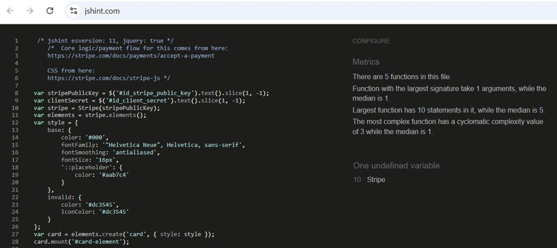
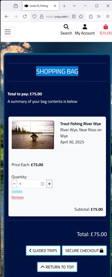
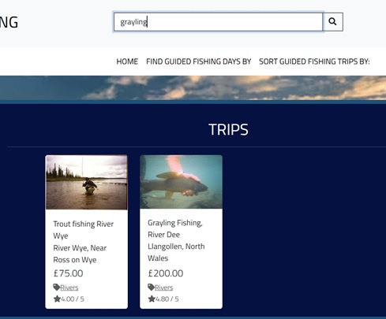

# Testing

> [!NOTE]  
> Return back to the [README.md](README.md) file.


In this document i provide the testing explanation and results for guideflyfishing the testing is broken down into the following sections 

### Code Validation 

In this section we validate the various code section with industry standards tools, to prove that the code follows correct formatting and mrryd brst practices.  

This would include 
 - HTML validaion
 - CSS validation 
 - Java script validation  
 - Python validation 

### Browser Compatability 

- Browser Compatibility: in this section we test on different browsers (Chrome, Firefox, Edge) to ensure consistent rendering and performance.
- Device Compatibility: Ensuring functionality across various devices (desktops/laptops, tablets, and mobile phones).

### Site Responsiveness 

 - Testing has been provided using the in built chrome tool Lighthouse 

### Regression Testing

 - Regression testing was carried out as part of the change process for the project, so as new features or changes were made regression testing was done
Such as after linting of code, addtion of a major feature.

### User Experience Testing:

- Uset testing in the project is centred upon demonstrating the features from the user stories and proving they are deliverd and work. 

### Defensive Progeramming Testing:

- This section details the testing involved to confirm the secuirty and expected behaviour of the site. 

### Bugs and Remediatation 

 - Bugs section details all the major bugs I had encountered when building this site, and explains the problem, the context, and the impact and also how fixed.

## Code Validation

I have validated the following code types within this project 
- Pyhton
- HTML 
- Javascript 
- CSS

The code vailidation is detailed below with which tools were used to validate 

### HTML
The following views from the website have been validated fro incorect tags and and order. 
The approach to use views was taken to avoid the noise produced from the tool that validating individaul files suffers with the presence of the Jinja syntax. 
In the testing details in the table the individual templates that are tested or included are documented for each view. 
Due to the large and complicated html files that are produced when combining mutiple Django tempaltes the individual temaplates have 
been commented to make resolution of HTML erros easier to find. ( e.g. starts here ... ends here)

 - home 
 - all trips 
 - detaile trsip 
 - edit product 
 - add product 
 - profile 
 - bag 
 - checkout
 - checkout succes 
 - check out order history 


I have used the recommended [HTML W3C Validator](https://validator.w3.org) to validate all of my HTML files.

| Directory/app | URL | Screenshot | Notes |
| --- | --- | ---- | ---- |
| Main | [Home](https://coelecanth-projectguide-5jtcemqmdr7.ws.codeinstitute-ide.net/) |  | |
| Main | Includes the following templates - base.html, banner.html, and the following includes main-nav.html, mobile-head.html  | |
| Bag | [Bag](https://p4guideflyfishing-879a54f37efc.herokuapp.com/bag/) |  | |
| Bag | Includes the following templates - Main (see above) Bag.html, and the following includes checkout-buttons.html, product-image.html, bag-total.html, product-info.html, quantity-form.html  | |
| Checkout |  [Checkout](hhttps://p4guideflyfishing-879a54f37efc.herokuapp.com/checkout/) |  | |
| Checkout | Includes the following templates - Main (see above) , checkout.html  | |
| Checkout success | [Checkout success](https://p4guideflyfishing-879a54f37efc.herokuapp.com/checkout/checkout_success/4ADBC2D740A541DDA554346A769D8E9A/) |  | |
| Checkout success | Main (see above) checkout_success.html | | |
| checkout-order history | [Checkout order history](https://p4guideflyfishing-879a54f37efc.herokuapp.com/profile/order_history/299C332D602443E3A2859144027C2C48) |  | |
| checkout-order history  | Main (see above) checkout_success.html | | |
| trips  | [All trips](https://p4guideflyfishing-879a54f37efc.herokuapp.com/trips/) | | |
| trips  | Main (see above) all_trips.html | | |
| trips | [Trip details]( https://p4guideflyfishing-879a54f37efc.herokuapp.com/trips/6/) |  | |
| trips | Main (see above) detail_trips.html | | |
| trips | [Add product](https://p4guideflyfishing-879a54f37efc.herokuapp.com/trips/add/) |  | |
| trips  | Main (see above) add_poduct.html | | |
| trips | [Edit product](https://p4guideflyfishing-879a54f37efc.herokuapp.com/trips/edit/6/) |  | |
| trips  | Main (see above) edit_poduct.html | | |
| profile | [profile](https://p4guideflyfishing-879a54f37efc.herokuapp.com/profile/) |  | |
| profile | Main (see above) profile.html | | |

### CSS

I have used the recommended [CSS Jigsaw Validator](https://jigsaw.w3.org/css-validator) to validate all of my CSS files.

| Directory | File | Screenshot | Notes |
| --- | --- | --- | --- |
| checkout | checkout.css |  | |
| profiles | profile.css |  | |
| static | base.css |  | |

### JavaScript

I have used the recommended [JShint Validator](https://jshint.com) to validate all of my JS files.

| Directory | File | Screenshot | Notes |
| --- | --- | --- | --- |
| checkout | stripe_elements.js |  | |
| profiles | countryfield.js |  | |
| Bag | embedded in bag.html |  | |
| Bag | embedded in qnty_inp.html |  | |


### Python

I have used the recommended [PEP8 CI Python Linter](https://pep8ci.herokuapp.com) to validate all of my Python files.

| Directory | File | CI URL | Screenshot | Notes |
| --- | --- | --- | --- | --- |
| bag | admin.py | [PEP8 CI](https://pep8ci.herokuapp.com/https://raw.githubusercontent.com/Coelecanth/Project-guideFlyFishing/main/bag/admin.py) |  | |
| bag | contexts.py | [PEP8 CI](https://pep8ci.herokuapp.com/https://raw.githubusercontent.com/Coelecanth/Project-guideFlyFishing/main/bag/contexts.py) |  | |
| bag | models.py | [PEP8 CI](https://pep8ci.herokuapp.com/https://raw.githubusercontent.com/Coelecanth/Project-guideFlyFishing/main/bag/models.py) |  | |
| bag | bag_tools.py | [PEP8 CI](https://pep8ci.herokuapp.com/https://raw.githubusercontent.com/Coelecanth/Project-guideFlyFishing/main/bag/templatetags/bag_tools.py) |  | |
| bag | urls.py | [PEP8 CI](https://pep8ci.herokuapp.com/https://raw.githubusercontent.com/Coelecanth/Project-guideFlyFishing/main/bag/urls.py) |  | |
| bag | views.py | [PEP8 CI](https://pep8ci.herokuapp.com/https://raw.githubusercontent.com/Coelecanth/Project-guideFlyFishing/main/bag/views.py) |  | |
| checkout | admin.py | [PEP8 CI](https://pep8ci.herokuapp.com/https://raw.githubusercontent.com/Coelecanth/Project-guideFlyFishing/main/checkout/admin.py) |  | |
| checkout | forms.py | [PEP8 CI](https://pep8ci.herokuapp.com/https://raw.githubusercontent.com/Coelecanth/Project-guideFlyFishing/main/checkout/forms.py) |  | |
| checkout | models.py | [PEP8 CI](https://pep8ci.herokuapp.com/https://raw.githubusercontent.com/Coelecanth/Project-guideFlyFishing/main/checkout/models.py) |  | |
| checkout | signals.py | [PEP8 CI](https://pep8ci.herokuapp.com/https://raw.githubusercontent.com/Coelecanth/Project-guideFlyFishing/main/checkout/signals.py) |  | |
| checkout | urls.py | [PEP8 CI](https://pep8ci.herokuapp.com/https://raw.githubusercontent.com/Coelecanth/Project-guideFlyFishing/main/checkout/urls.py) |  | |
| checkout | views.py | [PEP8 CI](https://pep8ci.herokuapp.com/https://raw.githubusercontent.com/Coelecanth/Project-guideFlyFishing/main/checkout/views.py) |  | |
| checkout | webhook_handler.py | [PEP8 CI](https://pep8ci.herokuapp.com/https://raw.githubusercontent.com/Coelecanth/Project-guideFlyFishing/main/checkout/webhook_handler.py) |  | |
| checkout | webhooks.py | [PEP8 CI](https://pep8ci.herokuapp.com/https://raw.githubusercontent.com/Coelecanth/Project-guideFlyFishing/main/checkout/webhooks.py) |  | |
| Root | custom_storages.py | [PEP8 CI](https://pep8ci.herokuapp.com/https://raw.githubusercontent.com/Coelecanth/Project-guideFlyFishing/main/custom_storages.py) |  | |
| guideflyfishing | decorators.py | [PEP8 CI](https://pep8ci.herokuapp.com/https://raw.githubusercontent.com/Coelecanth/Project-guideFlyFishing/main/guideflyfishing/decorators.py) |  | |
| guideflyfishing | settings.py | [PEP8 CI](https://pep8ci.herokuapp.com/https://raw.githubusercontent.com/Coelecanth/Project-guideFlyFishing/main/guideflyfishing/settings.py) |  | |
| guideflyfishing | urls.py | [PEP8 CI](https://pep8ci.herokuapp.com/https://raw.githubusercontent.com/Coelecanth/Project-guideFlyFishing/main/guideflyfishing/urls.py) |  | |
| guidetrip | admin.py | [PEP8 CI](https://pep8ci.herokuapp.com/https://raw.githubusercontent.com/Coelecanth/Project-guideFlyFishing/main/guidetrip/admin.py) |  | |
| guidetrip | forms.py | [PEP8 CI](https://pep8ci.herokuapp.com/https://raw.githubusercontent.com/Coelecanth/Project-guideFlyFishing/main/guidetrip/forms.py) |  | |
| guidetrip | models.py | [PEP8 CI](https://pep8ci.herokuapp.com/https://raw.githubusercontent.com/Coelecanth/Project-guideFlyFishing/main/guidetrip/models.py) |  | |
| guidetrip | urls.py | [PEP8 CI](https://pep8ci.herokuapp.com/https://raw.githubusercontent.com/Coelecanth/Project-guideFlyFishing/main/guidetrip/urls.py) |  | |
| guidetrip | views.py | [PEP8 CI](https://pep8ci.herokuapp.com/https://raw.githubusercontent.com/Coelecanth/Project-guideFlyFishing/main/guidetrip/views.py) |  | |
| guidetrip | widgets.py | [PEP8 CI](https://pep8ci.herokuapp.com/https://raw.githubusercontent.com/Coelecanth/Project-guideFlyFishing/main/guidetrip/widgets.py) |  | |
| home | admin.py | [PEP8 CI](https://pep8ci.herokuapp.com/https://raw.githubusercontent.com/Coelecanth/Project-guideFlyFishing/main/home/admin.py) |  | |
| home | models.py | [PEP8 CI](https://pep8ci.herokuapp.com/https://raw.githubusercontent.com/Coelecanth/Project-guideFlyFishing/main/home/models.py) |  | |
| home | custom_filters.py | [PEP8 CI](https://pep8ci.herokuapp.com/https://raw.githubusercontent.com/Coelecanth/Project-guideFlyFishing/main/home/templates/templatetags/custom_filters.py) |  | |
| home | urls.py | [PEP8 CI](https://pep8ci.herokuapp.com/https://raw.githubusercontent.com/Coelecanth/Project-guideFlyFishing/main/home/urls.py) |  | |
| home | views.py | [PEP8 CI](https://pep8ci.herokuapp.com/https://raw.githubusercontent.com/Coelecanth/Project-guideFlyFishing/main/home/views.py) |  | |
| Root | manage.py | [PEP8 CI](https://pep8ci.herokuapp.com/https://raw.githubusercontent.com/Coelecanth/Project-guideFlyFishing/main/manage.py) |  | |
| profiles | admin.py | [PEP8 CI](https://pep8ci.herokuapp.com/https://raw.githubusercontent.com/Coelecanth/Project-guideFlyFishing/main/profiles/admin.py) |  | |
| profiles | forms.py | [PEP8 CI](https://pep8ci.herokuapp.com/https://raw.githubusercontent.com/Coelecanth/Project-guideFlyFishing/main/profiles/forms.py) |  | |
| profiles | models.py | [PEP8 CI](https://pep8ci.herokuapp.com/https://raw.githubusercontent.com/Coelecanth/Project-guideFlyFishing/main/profiles/models.py) |  | |
| profiles | urls.py | [PEP8 CI](https://pep8ci.herokuapp.com/https://raw.githubusercontent.com/Coelecanth/Project-guideFlyFishing/main/profiles/urls.py) |   | |
| profiles | views.py | [PEP8 CI](https://pep8ci.herokuapp.com/https://raw.githubusercontent.com/Coelecanth/Project-guideFlyFishing/main/profiles/views.py) |  | |

## Browser Compatibility

The following browser were used to test the site and its functions 

- [Chrome](https://www.google.com/chrome)
- [Firefox (Developer Edition)](https://www.mozilla.org/firefox/developer)
- [Edge](https://www.microsoft.com/edge)

I've tested my deployed project on multiple browsers to check for compatibility issues, across the following pages.
The bag view was chosen over others, as it has quite complicated formatting changes between large and small screens.

| Browser | Home | trips | Bag  | Bag Mobile | Notes |
| --- | --- | --- | --- | --- |--- |
| Chrome |  |  |  |   | Works as expected |
| Firefox |  |  |  |  | Works as expected, with minor differeces, Firefox provides more padding to the container |
| Edge |  |  |  |  | Works as expected, with minor differeces, Edge provides more padding to the container |

## Responsiveness

I've tested my deployed project on following physical anmd emulated devices to check for responsiveness issues.
- Mobile (dev tools) 
- Tablet (dev tools)
- Desktop


| Device | Home | all trips | trip detail | Bag   | Notes |
| --- | --- | --- | --- | --- | --- |
| Mobile (DevTools) |  |  |  |  | Works as expected |
| Tablet (DevTools) |  |  |  |  | Works as expected |
| Desktop |  |  |  |  | Works as expected |

## Lighthouse Audit

I've tested my deployed project using the Lighthouse Audit tool to check for any major issues.

| Page | Mobile | Desktop | Notes |
| --- | --- | --- | --- |
| Home |  |  | Some minor warnings |
| All Trips |  |  | Slow response time due to mutiple images |
| Detail trips  |  |  |  Some minor warnings  |
| Bag  |  |  |  Some minor warnings  |

## Defensive Programming Testing

Defensive programming was manually tested with the below user acceptance testing:

| Page | Expectation | Test | Result | Fix | Screenshot |
| --- | --- | --- | --- | --- | --- |
| checkout | | | | | |
| | All customer fields on this page are mandatory with the exception of "street addres 2", and county and postcode | Tested by entering data in ome dtaa field at a time and then trying to submit the form | The feature behaved as expected, was prompted to complete fields | Test concluded and passed |  |
| | Credit card field and CC data fileds are mandatory | Tested by completing address fields and then trying to submit the form without CC details| The feature behaved as expected, was prompted to complete fields | test concluded and passed |  |
| profile  | | | | | |
| | You should only be able to see your own order history in profile | Tested the feature by opeing profile and reviewing visible orders. | The feature behaved as expected, and shows only orders peculiar to that user | Test concluded and passed |  |
| | user should be able to see only there data and update there personal information in there profile  | Tested the feature by updating some of the fields in the profile for that user  | The feature worked as expected | Test concluded and passed |  |
| | You should be able to open previous orders for the details from the profile page only for that user, and other users detail roder are not visisble. | Tested the feature by opening the profile and opening the detail of orders, and should show the alert showing this is a past order | The feature behaved as expected, and shows order details peculiar to that user, and the alert message | Test concluded and passed |  |
| Admin/Superuser | | | | | |
| | User who are not setup a s superuser cannot acces the admin page  | Tested the feature by logging in as a normal user and see if the admin function is avaialble to the user  | The feature behaved as expected, and it didnot show superuser access features | Test concluded and passed |  |
| | users who are not logged in cannot access the admin page or brute force to it | Tested the feature by logging out and then entering the admin URL manaually in the browser | Behaved as expected, I was taken to the logon page and barred access unless I entered credentials | Test concluded and passed|  |
| User/Not Registered User | | | | | |
| | User who are not setup as cannot acces the admin page  | Tested the feature by logging in as a normal user and see if the admin function is avaialble to the user  | The feature behaved as expected, and it did not show superuser access features | Test concluded and passed |  |
| | User who are not registred cannot access either user functions or superuser functions  | Tested the feature by opening the site as a non-registerd user and opening the my account pane | The feature behaved as expected, and it did not show user or superuser access features | Test concluded and passed |  |


## User Story Testing

The following user stroy test sceanrios wre derived from the the users stories fro users talked about in README.md

| User Story | Screenshot |
| --- | --- |
| As a new/registed site user/guide, I would like to see interactive responses confirming success. |  |
| As a new/registed site user/guide, I would like to see interactive respsonses confirming Alert. | |
| As a new/registed site user/guide, I would like to see interactive responses confirming Error. |  |
| As a new/registed site user/guide , I would like to search for trips. |  |
| As a new/registed site user/guide, I would like to to sort trips by category. | |
| As a new/registed site user/guide, I would like to to sort trips by rating, price. |  | 
| As a new/registed site user/guide, I would like to to purchase through the site. |  |
| As a new/registed site user/guide, I would like to receive notification by email of registration and/or purchase. |  |
| As a site superuser, I would like to see interactive responses confirming success. |  |
| As a site superuser, I would like to see interactive respsonses confirming Alert. | |
| As a site superuser, I would like to see interactive responses confirming Error. |  |
| As a site superuser, I would like to search for trips.|  |
| As a site superuser, I would like to to sort trips by category. | |
| As a site superuser, I would like to to sort trips by rating, price. |  |
| As a site superuser, I would like to to purchase through the site. |  |
| As a site superuser, I would like to receive notification by email of registration and/or purchase. |  |


## Automated testing 
As part of my testing of pages I created some automated tests in Django for the purpose of testing urls and views were working Eg i could load the page, the following points explain there purpsoe in more detail.

- Automated test to test URL links (as in views.py/urls.py) in Guideflyfishing 
- Regression testing when I made changes these were still functioning as expected 
- The pages would load e.g. no 404 errors 


# Bugs

## Bootstrap Errors Not Targeting Navbar Elements Correctly   

When i first setup Boot strap navbar using version 5.3, the drop down menus did not function correctly, as when you clickd on the 
the menu it did not drop down. After some very extensive research and collaboration, this was found to be a problem with changes
in bootstrap version 4.0 used in walkthrough and version 5.3    
the data target element in html has been updated in bootstrap 5.3 from
data-target 
to 
data-bs-target

Once corrected with data-bs-target in main.nav to define as a target this all worked  
This change was made in 5.3 to allow mutiple styling frameworks to be used. 

## Receiving Errors When I Push My Code To Github
    After Renaming my project in gitpod - to conform with naming guidance I started receiving the following error when I pushed code. 
    ```shell
            remote: Resolving deltas: 100% (1/1), completed with 1 local object.
            remote: This repository moved. Please use the new location:
            remote:   https://github.com/Coelecanth/Project4-guideflyfishing.git
            To https://github.com/Coelecanth/Project-guideFlyFishing.git
    ```
    The error is quite self explanatory, once I had correctly renamed the github site the errors were removed and and push worked without errors 

## Couldn’t Deploy App In Heroku With Auto Deploy     
    Received the following error in the Heroku log when trying to build app in heroku   

    	```shell
		    Collecting django-allauth==0.41.0 (from -r requirements.txt (line 4))
            Downloading django-allauth-0.41.0.tar.gz (545 kB)
            Preparing metadata (setup.py): started
            Preparing metadata (setup.py): finished with status 'error'
            error: subprocess-exited-with-error
    
            × python setup.py egg_info did not run successfully.
            exit code: 1
            [6 lines of output]
            Traceback (most recent call last):
            File "<string>", line 2, in <module>
            File "<pip-setuptools-caller>", line 34, in <module>
            File "/tmp/pip-install-ilh6jue2/django-allauth_02d68af6a9de44a490287dfb398a4bbe/setup.py", line 8, in <module>
            from setuptools import convert_path, find_packages, setup
            ImportError: cannot import name 'convert_path' from 'setuptools' (/app/.heroku/python/lib/python3.12/site-packages/setuptools/__init__.py)
            [end of output]
    
            note: This error originates from a subprocess, and is likely not a problem with pip.
            error: metadata-generation-failed
            
            × Encountered error while generating package metadata.
            See above for output.
    	```
    Heroku would not build and deploy python app, using Autodeploy in Heroku.  
    The above log excerpt from heroku build shows there is an issue with Allauth app, this was corrected by 
    moving from version 0041 as prescribed in the project walkthrough and moving to later version of 0054
    this was installed using the following command  pip3 install django-allauth==0.54.0
    

## The Update Button In The Bag Page Does Not Update The Values

the Update function in the bag does not work and behaves like there is no link. This wwas found to be a problem with the location of the tags in Bag.html,
which intiate the JS script to implement this function. Moved the a calls elelemts containing the JS scipt listeners outside the form element. 
the following code snippets show the before and after for bag.html 

```html
<!-- Original code -->
            <button class="increment-qty btn btn-sm btn-black rounded-0"
                    data-item_id="{{ item.item_id }}" id="increment-qty_{{ item.item_id }}">
                    <span><i class="fas fa-plus fa-sm"></i></span>
            </button>
            </div>
            </div>
        </div>
    <a class="update-link text-dark float-left"><small>Update</small></a>
    <a class="remove-item text-danger float-rig ht" id="remove_{{ item.item_id }}"><small>Remove</small></a>
    </form>    

<!-- Revised fix     -->
             <button class="increment-qty btn btn-sm btn-black rounded-0"
                    data-item_id="{{ item.item_id }}" id="increment-qty_{{ item.item_id }}">
                    <span><i class="fas fa-plus fa-sm"></i></span>
            </button>
            </div>
            </div>
        </div>
        </form>
        <!-- Do not put links inside the form as this break the update function it should remain outside the form tag -->
        <a class="update-link text-dark float-left"><small>Update</small></a>
        <a class="remove-item text-danger float-right" id="remove_{{ item.item_id }}"><small>Remove</small></a>
```

## Toast messages in the Application did not apply corectly  

    Following the course guidance on implementing toasts in the project walk through, the explanation omitted details 
    on the implementation of toast messages. In particualr it was not explained that the implemetation 
    described would produce a toast message only on the first addition of an item to the bag. It was not clear 
    if was an oversite or by design. In my implementation I wanted the toast message to appear 
    everytime an item was added to the bag.    

    To fix this i amended/added the following code to views.py in Bag app 
```python

# Original code - where toast is only raised on the first 
def add_to_bag(request, item_id):
    """ Add a quantity of the specified product to the shopping bag """

    product = trips.objects.get(pk=item_id)
    quantity = int(request.POST.get('quantity'))
    redirect_url = request.POST.get('redirect_url')
    bag = request.session.get('bag', {})

    if item_id in list(bag.keys()):
        bag[item_id] += quantity
        # missing code element here here to 
        # call toast message on subsequent additions
    else:
        bag[item_id] = quantity
        messages.success(request, f'Added {product.venue} to your bag')

    request.session['bag'] = bag
    return redirect(redirect_url)

# Revised code to provide toasts on all additions to the bag
def add_to_bag(request, item_id):
    """ Add a quantity of the specified product to the shopping bag """

    product = trips.objects.get(pk=item_id)
    quantity = int(request.POST.get('quantity'))
    redirect_url = request.POST.get('redirect_url')
    bag = request.session.get('bag', {})

    if item_id in list(bag.keys()):
        bag[item_id] += quantity
        # call toast message on subsequent additions
        messages.success(request, f'Added {product.venue} to your bag')
    else:
        bag[item_id] = quantity
        messages.success(request, f'Added {product.venue} to your bag')

    request.session['bag'] = bag
    return redirect(redirect_url)


```

## The Sorting Functionality from The Main Navigation Did Not Work

When selecting the sort function code would run but return no values were returned in the list. 
This was found to be a problem I had inadvertently introduced when correcting an earlier problem with getting viewing items by category to work and using specific variables to make the code easier to understand. In doing I had precluded myself from making the code compatible with sorting. 
So the image below show the original commented out code (in greeen)  followed by the amendments made to correct it directly following each commented out line 
So, in essence this recreates a new value called all_trips_rec instead of redefining all_trips  


## Web log returning error 404 for site URL for webhooks 

```log
[26/Oct/2024 12:54:20] "GET /trips/ HTTP/1.1" 200 32726
[26/Oct/2024 12:54:24] "GET /trips/4 HTTP/1.1" 200 17764
[26/Oct/2024 12:54:25] "POST /bag/add/4/ HTTP/1.1" 302 0
[26/Oct/2024 12:54:26] "GET /trips/4 HTTP/1.1" 200 20326
[26/Oct/2024 12:54:29] "GET /checkout/ HTTP/1.1" 200 21063
[26/Oct/2024 12:54:29] "GET /static/js/stripe_elements.js HTTP/1.1" 304 0
Not Found: /wh
[26/Oct/2024 12:54:29] "POST /wh HTTP/1.1" 404 2743
[26/Oct/2024 12:55:00] "POST /checkout/cache_checkout_data/ HTTP/1.1" 200 0
Not Found: /wh
[26/Oct/2024 12:55:01] "POST /wh HTTP/1.1" 404 2743
Not Found: /wh
[26/Oct/2024 12:55:01] "POST /wh HTTP/1.1" 404 2743
[26/Oct/2024 12:55:02] "POST /checkout/ HTTP/1.1" 302 0
[26/Oct/2024 12:55:03] "GET /checkout/checkout_success/B6221586515F45EFA645B4D92F3C1DBB/ HTTP/1.1" 200 16424
Not Found: /wh
[26/Oct/2024 12:55:03] "POST /wh HTTP/1.1" 404 2743

```
On closer inspection this was found to be a configuration error made in Stripe, where the endpoint webhook created stripe 
need to be amended

```log
- https://8000-coelecanth-projectguide-5jtcemqmdr7.ws.codeinstitute-ide.net/wh  
  to 
- https://8000-coelecanth-projectguide-5jtcemqmdr7.ws.codeinstitute-ide.net/checkout/wh
```


## Missing alternate image caused site to crash 

While I was regression testing checkout app,  I added an item to the bag with with a missing image file, this caused the site to crash.
I received the following error message  
```log
ValueError at / The 'image' attribute has no file associated with it. 
Request Method: GET Request URL: http://8000-coelecanth-projectguide-5jtcemqmdr7.ws.codeinstitute-ide.net/ 
Django Version: 3.2 Exception Type: ValueError Exception Value: The 'image' attribute has no file associated with it.

``` 
Refering to a line in the checkout template  

Th error was caused by a missing image file and no logic to handle this situation. 
This was corrected by adding an if statement around {{ item.product.image.url }}, with an latertive to the noimage image of 
To correct this I added the following code below checkout template, and then also had to add the load "static" statement on the toasts success page as this was 
also using a product image. 

```html
            <p class="logo-font bg-toast py-1">Your Bag ({{ product_count }})</p>
            <div class="bag-notification-wrapper">
                
                    <div class="row">
                         <div class="col-3 my-1">
                        <!-- the below line was replaced by the following code -->
                        <!--  -->
                            <!-- replaced code start -->
                            
                                
                            
                                
                            
                            <!-- replaced code end -->
                        </div>
                        <div class="col-9">
                            <p class="my-0"><strong>{{ item.product.venue }}</strong></p>
                            <p class="my-0 ">Qty: {{ item.quantity }}</p>
                        </div>
                    </div>
                
            </div>

``` 
## Site producing duplicate orders when submitting from checkout  

Site was producing duplicate orders when purchasing with Stripe, 2 orders were created in the orders database but one payment was produced in Stripe. 
After some investigation into this, the reason for this was in the implementation of the webhooks I had used, 
I had used only one set of details for the customer, e.g. as I was not shipping any products to people as they were buying a service. 
For this reason I had implemented just the billing Information only to validate the webhook's order against. This caused an issue when the 
test data being used, As I was using a different postcode for credit card and the billing address (e.g. the validation field for stripe credit card) 
which caused duplicate orders when in the database as the postcodes did not match. 
To avoid this error I changed the code in webhooks_handler.py to not evaluate the using postcode 
but continued to use all the other fields to validate the order, this would still allow strong validation of the user and payment but successfully resolved the issue.


the below code is shown from Webhook_handler.py shows the line thats was removed (commented out). 
```python
order_exists = False
attempt = 1
while attempt <= 5:
    try:
        order = Order.objects.get(
            full_name__iexact=billing_details.name,
            email__iexact=billing_details.email,
            phone_number__iexact=billing_details.phone,
            street_address1__iexact=billing_details.address.line1,
            street_address2__iexact=billing_details.address.line2,
            town_or_city__iexact=billing_details.address.city,
            # the following commented out line was removed 
            # postcode__iexact=billing_details.address.postal_code
            county__iexact=billing_details.address.state,
            country__iexact=billing_details.address.country,
            grand_total=grand_total,
            original_bag=bag,
            stripe_pid=pid,
        )
        order_exists = True
        break

```


## Web Server Errror 500 and no reverse route found for Page 

When creating edit capability for the products page, I received the following message where the reverse was route failing, detailing it had received no product.Id 
After making sure that views.py was receiving and passing the product.id to the template 


The problem was eventually traced to the template edit_procuct,html and where the product id in the django field was incorectly specified with "_" instead of ".". 
This was fixed with the following changes showing the before an after in the code.   


```html
    <!-- the following line was changed form the below to uncommneted out line to corect the issue -->
<!-- <form method="POST" action="" class="form mb-2" enctype="multipart/form-data"> -->
     <form method="POST" action="" class="form mb-2" enctype="multipart/form-data">
        
        {{ form | crispy }}
        <div class="text-end my-2">
            <a href=""
                class="shop-now-button-small btn btn-outline-black rounded-1 btn-lg text-uppercase"">
                    <span class=" icon"><i class="fas fa-chevron-left"></i></span>
                <span>Cancel</span>
            </a>
            <button class="shop-now-button-small btn btn-outline-black rounded-1 btn-lg text-uppercase"
                type="submit">Update Product</button>
        </div>

    </form>

```


## Pyhton Linting breaks code 

While I was perfroming regression testing after making changes to the pyton code for pyhton lint, it was found that the changes made to 
profiles.forms.py to make it confirm to Python best practice, caused the code to fail. (See image below) 
The changes made were based on suggested method given in the Pep8ci document, on splitting line (eg the line exceeded 79 characters) 
I had changed the code from being on asingle to split across two (see FAILED code below) and used [ ] and quote marks to encapsultate the HTML string. 
I used [ ] to differntiate from ( ) so it was more obvious to the code reviewer.   
On loading the profiles page I received the following message.


After some extensive investigation going through all the commits and the changes I made when linting the code and 
having narrowed it down to only chnages made on python files in profiles I eventually traced the error back to the below
lines, i tried placing lines 33 and 34 on a single line ecapsauled with [ ], but this also failed, even though documnentation says this should work. 
It was only after some experimenatation with this; removing brackets quote marks, that adding ( ) 
provided a solution, this was also subsequently tested with Pepc8i to make sure it conformed, which it does. 


```python
# profiles.forms.py Failed code 
33           self.fields[field].widget.attrs['class'] = ['rounded-1'  
34                                                       ' profile-form-input']
        
```

```python
# profiles.forms.py Corrected code 
33           self.fields[field].widget.attrs['class'] = ('rounded-1'
34                                                       ' profile-form-input')
```
# Unfixed Bugs

## Django Custom Clearabel File Input Widget

I implemented the Django Custom Clearable File Input widget as was shown in the walkthroughs and was not able to get this to display in the add/edit pages for trips.
Having reviewed the code for walkthrough and the researched, it looks like there is a compatibility issue between crispy forms and the custom widget. 
The later code in the walkthroughs splits the rendering of these with an if statement and even after implementing this, I could not get the widget to display in the page. 
I then spoke to student support who after some research came to the same conclusion; but we couldn’t find a solution in the time i had available to be tutored.
As the bug does not affect functionality but is really about presentation and styling of this function, this bug was not fixed.
The template and the widget.py have been left in the project as to demonstrate this was completed but not included. 


## Django File Handler 
When I started to design the role I had in mind to create a guide role. Which provided the ability to vendors (guides) to perform CRUD functions without the need to be a superuser, and hence could not logon to the admin portal but could perform the CRUD functions through the pages on their own trips they had created, I ran into an issue with the file handler widget for editing of trips when deployed to Heroku 
If you were creating a trip as a guide, you could add an image using the change file button which allows you to add the file to the site. Eg the file I uploads to S3 and is correctly displayed.  


However, when a trip had been already added and I wanted to edit; such as replace change the image file. The edit function would not allow you to add a URL pointing to the AWS S3 storage (say if you decided to change the image and it was present in S3). However you could upload another image from local storage. Which was not good behaviour as the storage would increases over time and the hosts would have to clean this up.
The project walkthrough from this only allows superusers to add files by directly uploading to S3, although the previous workarounf to renewing (new image upload) of this would suffice but is not ideal, 
after spending a significant amount of time with tutor support without a fix in site. I decided to document this as a minor issue, but should be resolved. 
